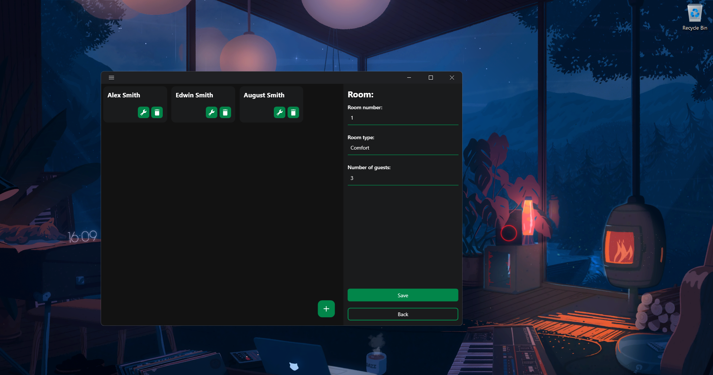

# Description of the project "Hotels manager":

## Languages
- [Українська](./README_UA.md)
- [Русский](./README_RU.md)
- [English](./README.md)

**"Hotels manager"** is a project application designed using **WPF .NET Core** to digitise information about hotels that already exist or will exist. The main functionality includes:
- Formation of hierarchy: **Hotel - Floor - Room (has type) - Guest (has reservation)**.
- Interface to interact with instances: add, delete, edit, display.
- Storing data in a database with **SQLite provider**.

## Adding a hotel:

To add a new hotel instance, you need to be on the **main page** of the application click on the button in the bottom right corner, a dialogue box will appear. After specifying the *name, address and number of stars of the hotel*, click on the **add button** and you will see the hotel cell appear on the main page. 
On the cell itself you can see the following controls: **delete, edit**. These buttons are also available on the cells of instances of *floors, rooms and guests*. Clicking on the edit button opens the page with this instance. 
In the case of a hotel, clicking on this button will allow you to change the hotel data that was entered during creation, as well as to add floors. The same principle applies to other elements in the hierarchy. 

## Adding a floor:

On the Edit Hotel page, in the bottom right corner of the list of floors, there is a button to click on which you will be greeted by a dialogue box for adding a floor, from the required information only the floor number.

## Adding a room / room type:

The application has a structure where a room cannot exist without a type. The interface for adding and editing room types is located in the **side menu** of the application - which can be accessed by clicking on the button in the top left corner of the application. The number of room types is unlimited, the required parameters are the: **name of the type, the maximum number of guests in the room and the price per day of rental (no currency).**

To add a room already, we need to go to the floor edit page, and just like before click on the button at the bottom of the list, fill in the room field and select the type.

## Adding a guest:

To add a new guest to the hierarchy of a particular hotel, we need to go to the room edit page and click the button we already know. We fill in the fields with the information: **First name, last name, age and rental duration in days.**

As soon as we add a new guest to a certain room, together with the guest we will also create an instance of reservation (booking), where will be specified: the path to the guest, his ID, the period of stay and the total cost of rent for all days based on the cost of a room of a certain type.

## Conclusion:
To summarise what I have previously said, this application is quite useful although it is limited in functionality, but it can always be upgraded to more specific criteria, whereas now it has a basic functionality.
