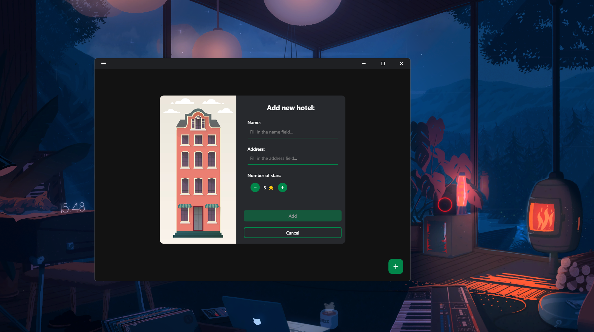
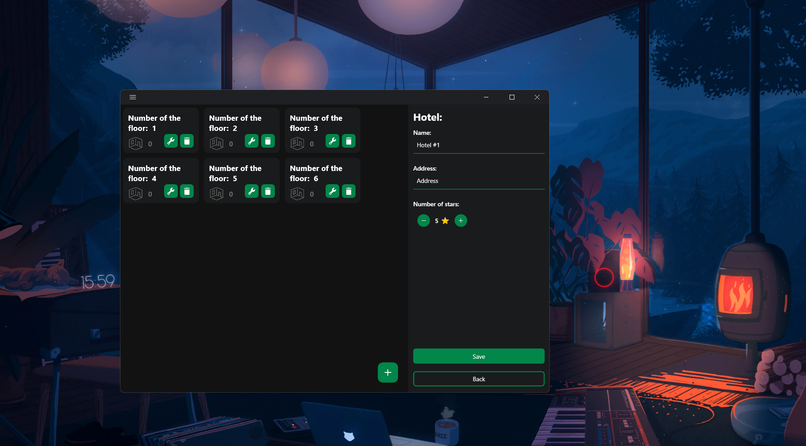
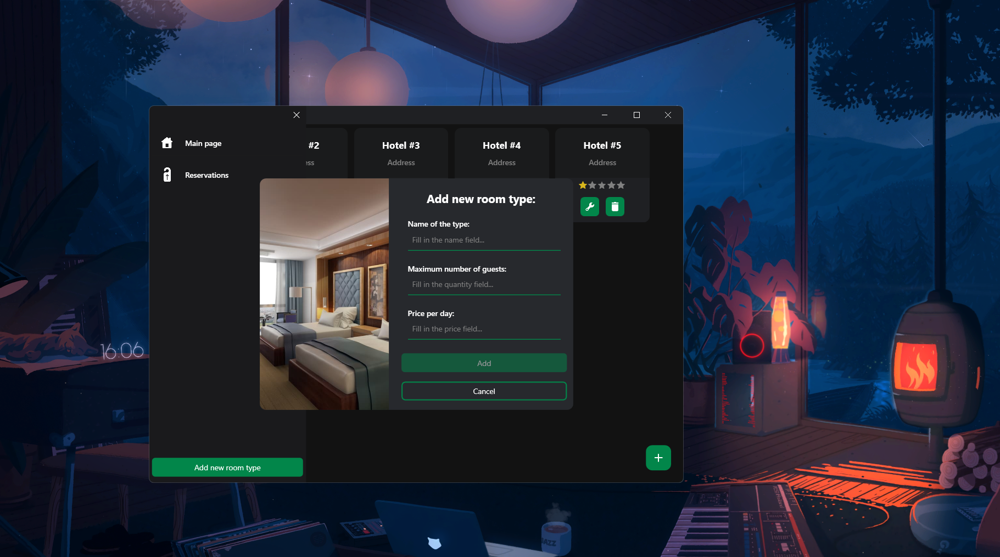
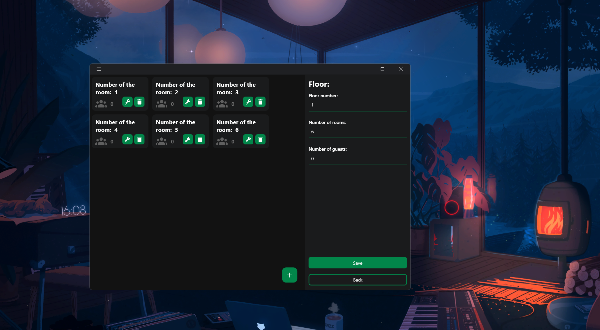
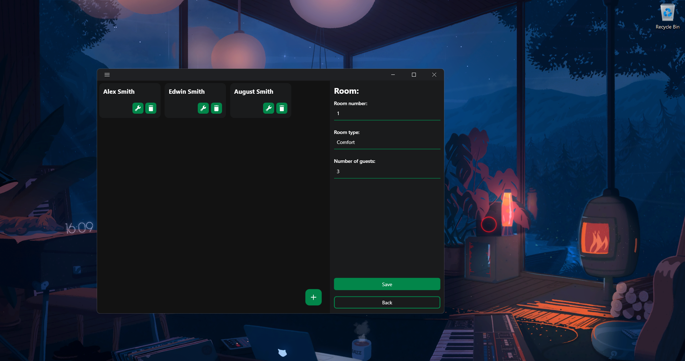
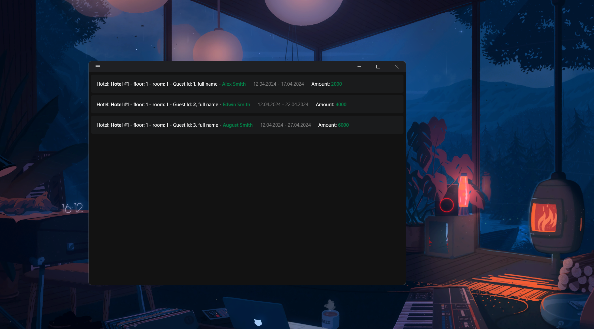

# Описание проекта "Hotels manager":

## Языки
- [English](./README.md)
- [Українська](./README_UA.md)
- [Русский](./README_RU.md)

**"Hotels manager "** - это проект приложение, предназначенное для оцифровки информации об отелях, которые уже существуют или будут существовать. Основной функционал включает в себя:
- Формирование иерархии: **Отель - Этаж - Комната (имеет тип) - Гость (имеет бронь)**.
- Интерфейс для взаимодействия с экземплярами: добавление, удаление, редактирование, отображение.
- Хранение данных в базе данных с помощью **SQLite-провайдера**.

## Добавление отеля:

Чтобы добавить новый экземпляр отеля, необходимо, находясь на **главной странице** приложения, нажать на кнопку в правом нижнем углу, появится диалоговое окно. Указав *название, адрес и количество звезд отеля*, нажмите на кнопку **добавить**, и вы увидите, как на главной странице появится ячейка отеля. 
На самой ячейке вы можете увидеть следующие элементы управления: **удалить, редактировать**. Эти кнопки также доступны на ячейках с экземплярами *этажей, номеров и гостей*. При нажатии на кнопку редактирования открывается страница с этим экземпляром. 
В случае с отелем нажатие на эту кнопку позволит вам изменить данные отеля, введенные при создании, а также добавить этажи. Тот же принцип применим и к другим элементам иерархии. 

## Добавление этажа:

На странице редактирования отеля, в правом нижнем углу списка этажей, есть кнопка, нажав на которую, вы попадете в диалоговое окно добавления этажа, из необходимой информации только номер этажа.

## Добавление комнаты / типа комнаты:

Приложение имеет структуру, в которой комната не может существовать без типа. Интерфейс для добавления и редактирования типов комнат находится в **боковом меню** приложения, доступ к которому можно получить, нажав на кнопку в левом верхнем углу приложения. Количество типов помещений не ограничено, необходимыми параметрами являются: **название типа, максимальное количество гостей в комнате и цена за сутки аренды (без валюты)**.

Чтобы добавить комнату, нам нужно перейти на страницу редактирования этажа и, как и раньше, нажать на кнопку внизу списка, заполнить поле номера и выбрать тип.

## Добавление гостя:

Чтобы добавить нового гостя в иерархию конкретного отеля, нам нужно перейти на страницу редактирования комнаты и нажать уже знакомую нам кнопку. Заполняем поля информацией: **Имя, фамилия, возраст и продолжительность аренды в днях**.

Как только мы добавим нового гостя в определенный номер, вместе с гостем мы также создадим экземпляр резервирования (бронь), где будут указаны: путь к гостю, его ID, срок пребывания и общая стоимость аренды за все дни исходя из стоимости номера определенного типа.

## Заключение:
Подводя итог сказанному, можно сказать, что данное приложение довольно полезно, хотя и ограничено в функциональности, но его всегда можно доработать до более конкретных критериев, тогда как сейчас оно имеет базовый функционал.
