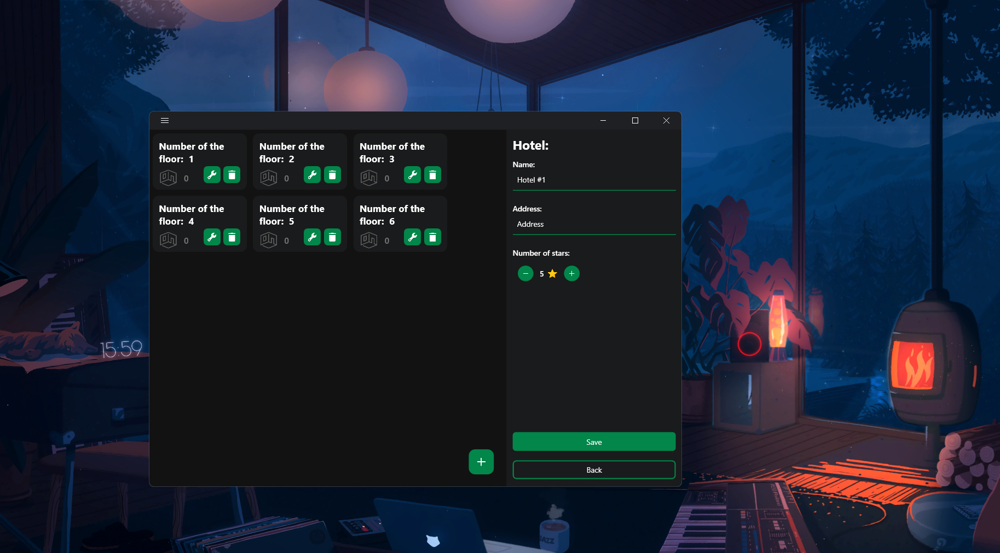
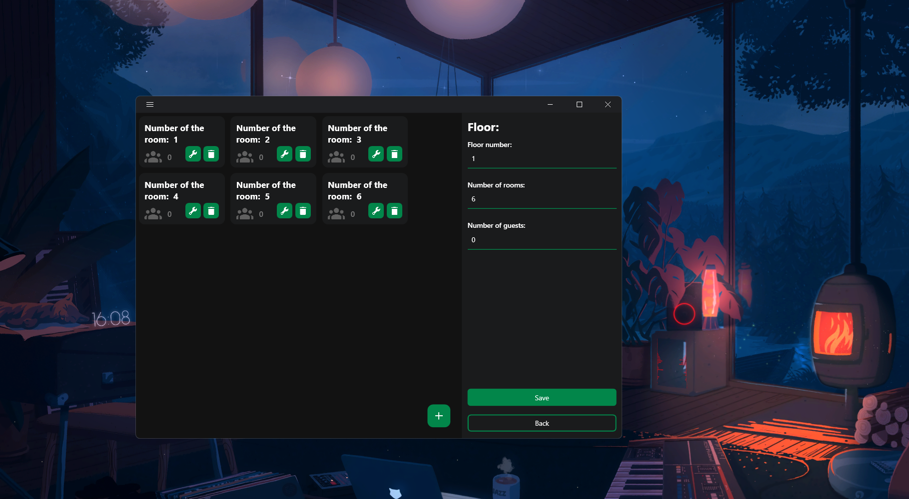

# Опис проекту "Hotels manager":

## Мови
- [English](./README.md)
- [Русский](./README_RU.md)
- [Українська](./README_UA.md)

**"Менеджер готелів "** - проектний додаток, призначений для оцифрування інформації про готелі, які вже існують або будуть існувати. Основний функціонал включає в себе:
- Формування ієрархії: **Готель - Поверх - Номер (має тип) - Гість (має бронювання)**.
- Інтерфейс для взаємодії з екземплярами: додавання, видалення, редагування, відображення.
- Зберігання даних в базі даних у **SQLite провайдера**.

## Додавання готелю:

Для того, щоб додати новий екземпляр готелю, необхідно на **головній сторінці** додатку натиснути на кнопку в правому нижньому куті, з'явиться діалогове вікно. Вказавши *назву, адресу та кількість зірок готелю*, натисніть на кнопку **додати** і ви побачите, як на головній сторінці з'явиться комірка з готелем. 
У самій комірці ви можете побачити наступні елементи керування: **видалити, редагувати**. Ці кнопки також доступні на комірках екземплярів *поверхів, номерів і гостей*. При натисканні на кнопку редагування відкривається сторінка з цим екземпляром. 
У випадку з готелем, натискання на цю кнопку дозволить вам змінити дані готелю, які були введені при створенні, а також додати поверхи. Цей же принцип застосовується і до інших елементів ієрархії. 

## Додавання поверху:

На сторінці редагування готелю, в правому нижньому куті списку поверхів, є кнопка, при натисканні на яку відкривається діалогове вікно для додавання поверху, з необхідної інформації тільки номер поверху.

## Додавання кімнати / тип кімнати:

Додаток має структуру, в якій кімната не може існувати без типу. Інтерфейс для додавання та редагування типів кімнат знаходиться в **боковому меню** додатку, доступ до якого можна отримати, натиснувши на кнопку у верхньому лівому куті додатку. Кількість типів кімнат необмежена, необхідними параметрами є **назва типу, максимальна кількість гостей у номері та ціна за добу оренди (без валюти).**.

Щоб вже додати кімнату, нам потрібно перейти на сторінку редагування поверху, і так само, як і раніше, натиснути на кнопку внизу списку, заповнити поле номер і вибрати тип.

## Додавання гостя:

Щоб додати нового гостя в ієрархію конкретного готелю, нам потрібно перейти на сторінку редагування кімнати і натиснути вже знайому нам кнопку. Заповнюємо поля інформацією: **Ім'я, прізвище, вік та тривалість оренди в днях.**.

Як тільки ми додамо нового гостя в певний номер, разом з гостем ми також створимо екземпляр резервування (бронювання), де буде вказано: шлях до гостя, його ID, період проживання та загальна вартість оренди за всі дні, виходячи з вартості номера певного типу.

## Висновок:
Підсумовуючи вищесказане, можна сказати, що цей додаток досить корисний, хоча і обмежений у функціоналі, але його завжди можна модифікувати до більш конкретних критеріїв, тоді як зараз він має базовий функціонал.
